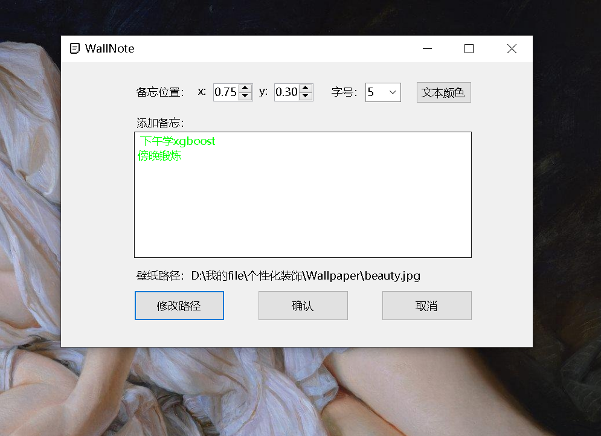
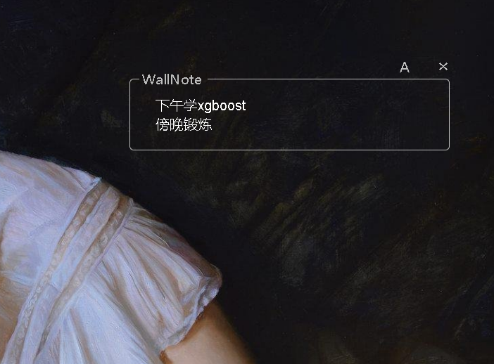
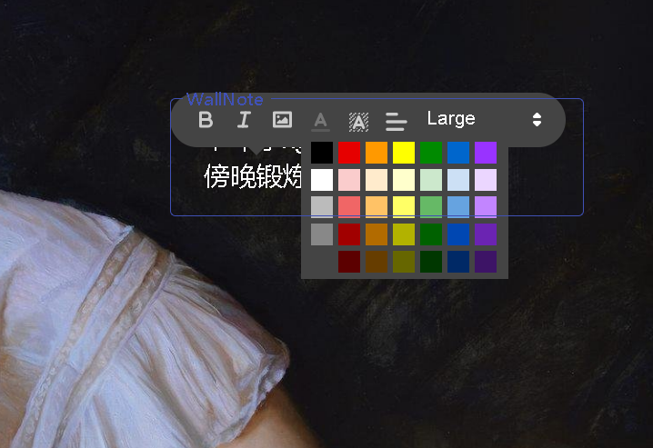

## WallNote

### 简介

这个小程序一共经历了两个版本。

#### 第一个版本

采用winform提供图形化窗口，调用python打包的exe文件，将文字贴到图片上并调用系统接口设为壁纸。但这个版本的WallNote丑、无法拖动、模糊、打开慢……

#### 第二个版本(建议使用)

electron+前端三件套

1. 使用了material design for bootsrap、quill进行界面和功能的完善
2. 使用electron-drag实现了隐藏窗口的可拖动化(借鉴该项目的issue对源码有一定修改，见release)
3. 避免重复打开同一窗口
4. 提供了开机自启动功能

### 使用

1. 解压release中发布包至不含中文和空格的路径。
2. 双击exe打开窗口，正中是文本编辑区。
3. 文本框上方可拖动，右侧可点击"x"关闭窗口。
4. "A"代表开机自启动，"M"代表需要手动启动，点击字母可以切换模式。

### 不足

1. 由于html获取自身路径的问题，**文件路径不应含有空格和中文**
2. electron仅提供了always on top的功能，而无法实现将该窗口嵌入桌面。按win+D或显示桌面按钮时窗口会消失
3. 暂时还没有实现其为后台进程，cpu、内存耗费还是有点高的

